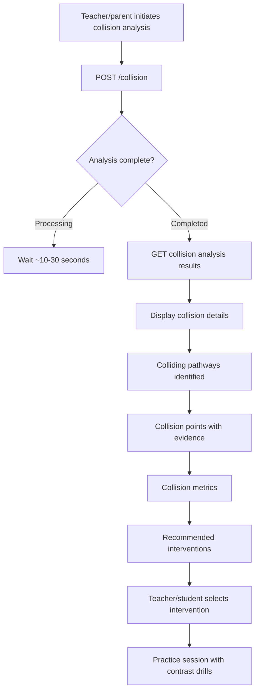

# MVP Alignment Document – ATOM-SG Pilot v4.1

**Status:** ✅ C4 Complete – MVP aligned with approved backend API spec
**Last Updated:** 2026-04-15 06:20 SGT
**Backend Spec Status:** ✅ Approved (2026-04-15 06:16 SGT) – Proportional rendering requirement included
**MVP Deployment Target:** Week 2 (2026-04-26)

---

## Executive Summary

This document aligns the MVP features (defined in SOR v4.1) with the backend API endpoints (approved in C3). The MVP implements a **Recognition-First Integrated Training** model where students must identify problem pathways and articulate equation shadows before solving, with instant triad feedback on all three dimensions.

**Key Achievements:**
- ✅ All MVP features mapped to approved backend endpoints
- ✅ User flows documented for all key workflows
- ✅ Technical considerations defined for static HTML5 + JS frontend
- ✅ Week 2-5 implementation timeline aligned with backend readiness
- ✅ Dependencies on backend implementation clearly identified

---

## 1. MVP Feature List → Backend Endpoint Mapping

### 1.1 Core MVP Features (Week 2)

| MVP Feature | Description | Backend Endpoint(s) | Status |
|-------------|-------------|---------------------|--------|
| **Problem Display** | Show problems with embedded diagrams rendered proportionally to scale | `GET /problems`, `GET /problems/{id}`, `POST /renders`, `GET /renders/{id}` | ✅ Ready |
| **Forced Articulation** | Student must identify pathway type + articulate equation shadow before solving | `POST /practice` (standalone) or `POST /practice-sessions/{id}/submit` (session-based) | ✅ Ready |
| **Instant Triad Feedback** | Green/yellow/red feedback on pathway ID + articulation + solution | `POST /practice` response or `POST /practice-sessions/{id}/submit` response | ✅ Ready |
| **Model Articulations** | Students see ideal articulations for comparison (Priority 2 enhancement) | Feedback response includes `modelArticulation` field | ✅ Ready |
| **Pathway Radar Warm-up** | Daily 5-minute drill with 10 mixed pathway identification questions | `GET /pathway-radar/questions`, `POST /pathway-radar/submit` | ✅ Ready |
| **Progress Tracking** | Visual dashboard showing milestone progress (problems completed, accuracy, articulation level) | `GET /milestones`, `PATCH /milestones/{id}` | ✅ Ready |
| **Digital Reflection Sheets** | Student submits weekly reflections on learning | `POST /reflections`, `GET /reflections` | ✅ Ready |

### 1.2 Extended MVP Features (Week 3-4)

| MVP Feature | Description | Backend Endpoint(s) | Status |
|-------------|-------------|---------------------|--------|
| **Cross-Thread Collision Detection** | Analyze when student confuses similar pathways | `POST /collision` | ✅ Ready |
| **Data Interpretation Analytics** | Detailed metrics on red herring detection, outlier identification | `GET /interpretation` | ✅ Ready |
| **Intervention Recommendations** | Suggested practice problems based on collision/weakness analysis | `POST /collision` response includes `recommendedInterventions` | ✅ Ready |

### 1.3 Assessment Features (Week 1 & Week 5)

| MVP Feature | Description | Backend Endpoint(s) | Status |
|-------------|-------------|---------------------|--------|
| **Baseline Test PDF Generation** | Print 40-question test (20 WP + 12 Geo + 8 DI) | `GET /problems/pdf?week=1` | ✅ Ready |
| **Baseline Scan Upload** | Parent/teacher uploads completed test for OCR processing | `POST /scans` | ✅ Ready |
| **Gap Map Generation** | Identify 3 weakest pathways from baseline results | `GET /scans/{id}` response includes `gapMap` | ✅ Ready |
| **Transfer Test PDF Generation** | Print 40 new unseen problems | `GET /problems/pdf?week=5` | ✅ Ready |
| **Transfer Scan Upload** | Upload completed transfer test | `POST /scans` | ✅ Ready |
| **Ramp-up Analytics** | Compare baseline vs. transfer performance | `GET /analytics/transfer` | ✅ Ready |
| **Progress Overview** | Track weekly progress across all weeks | `GET /analytics/progress` | ✅ Ready |

### 1.4 Technical Infrastructure Features

| MVP Feature | Description | Backend Endpoint(s) | Status |
|-------------|-------------|---------------------|--------|
| **Diagram Rendering** | Proportional rendering of bar models, pie charts, geometric shapes | `POST /renders`, `GET /renders/{id}`, `GET /renders` | ✅ Ready |
| **OCR Processing** | Extract handwritten answers from scanned tests | `POST /scans`, `GET /scans/{id}` | ✅ Ready |
| **Student Drawing/Annotation** | Canvas tool for students to sketch/annotate diagrams | Frontend only – annotations sent via `POST /practice` or `POST /practice-sessions/{id}/submit` | ✅ Ready |
| **Health Monitoring** | System status check for debugging | `GET /system/health`, `GET /system/stats` | ✅ Ready |

---

## 2. User Flow Diagrams

### 2.1 Week 1 – Baseline Test Flow

```mermaid
graph TD
    A[Student] --> B[Print Baseline Test PDF]
    B --> C[GET /problems/pdf?week=1]
    C --> D[Student completes 40-question test on paper]
    D --> E[Parent/teacher scans completed test]
    E --> F[Upload via MVP interface]
    F --> G[POST /scans]
    G --> H{OCR Processing}
    H -->|Processing| I[Wait ~30 seconds]
    H -->|Completed| J[GET /scans/{id}]
    J --> K[Display gap map with 3 weakest pathways]
    K --> L[Weeks 2-4 intervention planned based on gap map]
```

**Backend Dependencies:**
- `GET /problems/pdf?week=1` – Generate baseline test PDF
- `POST /scans` – Upload scan for OCR
- `GET /scans/{id}` – Retrieve OCR results + gap map

**Frontend Implementation:**
- Print button triggers `GET /problems/pdf?week=1`
- File upload form calls `POST /scans` (multipart/form-data)
- Polling mechanism to check scan status (`GET /scans/{id}`)
- Display gap map visualization (text + charts)

**Timeline:**
- Week 1 (2026-04-19 to 2026-04-25)
- Backend must be ready by 2026-04-22 for testing

### 2.2 Week 2 – Daily Practice Flow (Session-Based)

```mermaid
graph TD
    A[Student logs in] --> B{Warm-up complete?}
    B -->|No| C[Start Pathway Radar]
    C --> D[GET /pathway-radar/questions]
    D --> E[Answer 10 identification questions]
    E --> F[POST /pathway-radar/submit]
    F --> G[View feedback on strong/weak pathways]
    G --> B
    B -->|Yes| H[Start Practice Session]
    H --> I[POST /practice-sessions]
    I --> J[Receive curated problem list]
    J --> K[GET /practice-sessions/{id}]
    K --> L[Display problem with embedded diagram]
    L --> M{Articulation complete?}
    M -->|No| N[Show forced articulation form]
    N --> O[Student inputs pathway type + equation shadow]
    O --> M
    M -->|Yes| P[Student solves problem]
    P --> Q[Student optionally annotates diagram]
    Q --> R[POST /practice-sessions/{id}/submit]
    R --> S[Receive instant triad feedback]
    S --> T{More problems?}
    T -->|Yes| U[GET /practice-sessions/{id} for next problem]
    U --> L
    T -->|No| V[Complete session, view progress]
    V --> W[PATCH /milestones/{id} with progress]
```

**Backend Dependencies:**
- `GET /pathway-radar/questions` – Get warm-up questions
- `POST /pathway-radar/submit` – Submit warm-up answers
- `POST /practice-sessions` – Start practice session
- `GET /practice-sessions/{id}` – Get current problem
- `POST /practice-sessions/{id}/submit` – Submit answer with forced articulation
- `PATCH /milestones/{id}` – Update progress

**Frontend Implementation:**
- Warm-up timer (5 minutes)
- Forced articulation form (pathway type + equation shadow text inputs)
- Diagram display with proportional rendering (embed SVG from `GET /renders/{id}`)
- Canvas tool for diagram annotations
- Triad feedback display (pathway ID, articulation, solution, overall color)
- Progress bar (problems completed vs. total)

**Timeline:**
- Week 2 (2026-04-26 to 2026-05-02)
- Daily practice: 5 min warm-up + 15 min practice
- Backend ready by 2026-04-25 (integration testing complete)

### 2.3 Week 3 – Cross-Thread Collision Detection Flow



**Backend Dependencies:**
- `POST /collision` – Analyze collision patterns
- Response includes: `collisionDetails`, `collisionMetrics`, `recommendedInterventions`

**Frontend Implementation:**
- Collision analysis trigger (manual or automated after Week 2)
- Visualization of colliding pathways (side-by-side comparison)
- Collision point display with problem examples and evidence
- Intervention recommendation cards (with priority levels)
- One-click start for recommended practice problems

**Timeline:**
- Week 3 (2026-05-03 to 2026-05-09)
- Run collision analysis after Week 2 completion
- Backend enhancements needed: `POST /collision` endpoint

### 2.4 Week 5 – Transfer Test Flow

```mermaid
graph TD
    A[Student completes Weeks 2-4 intervention] --> B[Print Transfer Test PDF]
    B --> C[GET /problems/pdf?week=5]
    C --> D[Student completes 40 new problems on paper]
    D --> E[Parent/teacher scans completed test]
    E --> F[Upload via MVP interface]
    F --> G[POST /scans]
    G --> H{OCR Processing}
    H -->|Processing| I[Wait ~30 seconds]
    H -->|Completed| J[GET /scans/{id}]
    J --> K[GET /analytics/transfer]
    K --> L[Display ramp-up metrics]
    L --> M[Trained pathways performance]
    M --> N[Held-back pathways performance]
    N --> O[Success criteria evaluation]
    O --> P[Overall improvement metrics]
```

**Backend Dependencies:**
- `GET /problems/pdf?week=5` – Generate transfer test PDF
- `POST /scans` – Upload scan for OCR
- `GET /scans/{id}` – Retrieve OCR results
- `GET /analytics/transfer` – Get ramp-up metrics + success criteria

**Frontend Implementation:**
- Print button triggers `GET /problems/pdf?week=5`
- File upload form calls `POST /scans`
- Ramp-up analytics dashboard
- Success criteria visualization (green checkmarks for met targets)
- Comparison charts (baseline vs. transfer performance)

**Timeline:**
- Week 5 (2026-05-17 to 2026-05-23)
- Backend performance validation required
- Success criteria: ≥90% ID accuracy, ≥90% articulation Level 2+, ≥80% solving improvement

---

## 3. Technical Considerations

### 3.1 Frontend Architecture (Static HTML5 + JavaScript)

**Technology Stack:**
- **HTML5** – Semantic markup for accessibility
- **Vanilla JavaScript (ES6+)** – No framework overhead
- **CSS3** – Styling with Flexbox/Grid for responsive layout
- **SVG** – Inline SVG for diagrams (from backend renders)
- **Fetch API** – HTTP requests to backend endpoints

**Why Static HTML5 + JS?**
- ✅ Minimal overhead – no build process, no dependencies
- ✅ Fast iteration – easy to modify based on student data
- ✅ Local-first – works offline after initial load
- ✅ Cross-browser – works on Chrome, Safari, Edge, Firefox
- ✅ Suitable for pilot – sufficient complexity, not over-engineered

**Key Frontend Components:**

1. **Problem Display Component**
   - Renders problem text with embedded diagrams
   - Displays proportional bar models, pie charts, geometric shapes
   - Responsive layout for laptop/tablet

2. **Forced Articulation Form**
   - Pathway type dropdown (pre-populated from SOR v4.1 pathways)
   - Equation shadow text area (multi-line)
   - Validation: Both fields required before solving enabled
   - Auto-save draft (localStorage) to prevent data loss

3. **Triad Feedback Component**
   - Pathway identification section (correct/incorrect + confidence)
   - Articulation section (level + feedback + model articulation comparison)
   - Solution section (correct/incorrect + score)
   - Overall color coding (green/yellow/red)
   - Recommended next steps (actionable list)

4. **Pathway Radar Component**
   - 10-question rapid identification drill
   - Timer display (30 seconds per question)
   - Progress bar (questions completed)
   - Immediate feedback after submission
   - Strong/weak pathways visualization

5. **Canvas Annotation Tool**
   - Simple drawing canvas overlay on diagrams
   - Tools: Pen (freehand), Line, Rectangle, Circle, Text
   - Export annotations as coordinate array
   - Send with `POST /practice` or `POST /practice-sessions/{id}/submit`

6. **Progress Dashboard**
   - Milestone status (in-progress/completed)
   - Problems completed vs. total (progress bar)
   - Average score and accuracy metrics
   - Pathway identification accuracy
   - Articulation level trend (line chart)
   - Weekly progress summary

7. **Digital Reflection Sheet**
   - Week selection dropdown
   - Pathway selection dropdown
   - Reflection text area (multi-line)
   - Confidence slider (1-5 scale)
   - Struggles tags (multi-select)
   - Improvements tags (multi-select)
   - Submit button calls `POST /reflections`

### 3.2 Backend Integration Considerations

**Base URL:** `http://localhost:5000/api/v1`

**Authentication:** None required for pilot (single-student assumption)

**Error Handling:**
- Display user-friendly error messages
- Retry failed requests (up to 3 times with exponential backoff)
- Graceful degradation for non-critical features
- Log errors to console for debugging

**Timeout Configuration:**
- Problem retrieval: 5 seconds
- Practice submission: 10 seconds
- OCR processing: 60 seconds (with polling every 5 seconds)
- Render generation: 30 seconds (with polling every 2 seconds)
- Collision analysis: 60 seconds (async processing)

**Data Caching:**
- Cache problem data in localStorage (24-hour TTL)
- Cache diagram renders (SVG) for 7 days
- Cache milestone progress (update on every submission)
- Clear cache on new week start

**Responsive Design:**
- Desktop-first approach (laptop/tablet)
- Minimum viewport: 1024px × 768px
- Test on: Chrome, Safari, Edge, Firefox
- Mobile not supported (pilot requirement)

### 3.3 Proportional Rendering Requirement

**Critical Requirement:** All visual diagrams must be proportionally accurate to scale.

**Validation Rules:**
- Bar lengths must be mathematically proportional to values
- Pie chart sectors must accurately represent percentages
- Geometric shapes must match problem statement dimensions
- Number lines must have evenly spaced tick marks
- Scale deviation > 5% → reject render and flag for review

**Frontend Display:**
- Embed SVG renders directly in problem display (no scaling)
- Display `scaleFactor` and `deviation` metadata from backend
- Show validation badge (✅ validated or ⚠️ needs review)
- Allow download of original SVG if needed

### 3.4 Accessibility Considerations

**Semantic HTML:**
- Use `<main>`, `<section>`, `<article>`, `<nav>` tags
- Proper heading hierarchy (h1, h2, h3)
- Labels for all form inputs
- Alt text for diagrams (auto-generated from problem text)

**Keyboard Navigation:**
- Tab order follows natural reading order
- Enter key submits forms
- Escape key cancels modal dialogs
- Arrow keys navigate dropdown lists

**Screen Reader Support:**
- ARIA labels for interactive elements
- Live regions for dynamic content (feedback, progress)
- Skip navigation link for screen reader users
- High contrast mode support

---

## 4. Implementation Timeline (Weeks 2-5)

### Week 2 (2026-04-26 to 2026-04-30) – Integrated Intervention

**Backend Readiness:** ✅ All core endpoints must be ready

| Date | Frontend Task | Backend Endpoint | Status |
|------|---------------|------------------|--------|
| 2026-04-22 | Implement problem display component | `GET /problems`, `GET /problems/{id}`, `GET /renders/{id}` | 🟡 Pending |
| 2026-04-23 | Implement forced articulation form | `POST /practice-sessions`, `POST /practice` | 🟡 Pending |
| 2026-04-24 | Implement triad feedback display | `POST /practice-sessions/{id}/submit`, `POST /practice` | 🟡 Pending |
| 2026-04-24 | Implement pathway radar component | `GET /pathway-radar/questions`, `POST /pathway-radar/submit` | 🟡 Pending |
| 2026-04-25 | Implement progress dashboard | `GET /milestones`, `PATCH /milestones/{id}` | 🟡 Pending |
| 2026-04-25 | Implement digital reflection sheet | `POST /reflections`, `GET /reflections` | 🟡 Pending |
| 2026-04-25 | Integration testing (all components) | All core endpoints | 🟡 Pending |
| 2026-04-26 | **MVP Week 2 Launch** | — | ⏳ Target |

**Backend Dependencies:**
- All core endpoints implemented and tested
- OCR pipeline operational (70% confidence threshold)
- TikZ rendering service operational (≤5% deviation)
- Artifact repository structure ready (`renders/`, `ocr/`, `practice/`)

**Success Criteria:**
- Student can complete daily practice (warm-up + practice session)
- Triad feedback displays correctly for all three dimensions
- Progress updates in milestones dashboard
- No critical bugs or errors

### Week 3 (2026-05-03 to 2026-05-07) – Pathway Deepening

**Backend Readiness:** ✅ Core endpoints stable + Extended endpoints ready

| Date | Frontend Task | Backend Endpoint | Status |
|------|---------------|------------------|--------|
| 2026-05-01 | Implement collision analysis display | `POST /collision` | 🔮 Not started |
| 2026-05-01 | Implement intervention recommendations | `POST /collision` response | 🔮 Not started |
| 2026-05-02 | Implement data interpretation analytics | `GET /interpretation` | 🔮 Not started |
| 2026-05-02 | Add contrast drill practice mode | `POST /practice-sessions` | 🔮 Not started |
| 2026-05-03 | **MVP Week 3 Launch** | — | ⏳ Target |

**Backend Dependencies:**
- `POST /collision` endpoint operational
- `GET /interpretation` endpoint operational
- Collision detection algorithm tested
- Red herring analysis validated

**Success Criteria:**
- Collision analysis runs successfully
- Intervention recommendations are actionable
- Student can practice contrast drills
- Data interpretation metrics are accurate

### Week 4 (2026-05-10 to 2026-05-14) – MVP Expansion

**Backend Readiness:** ✅ All endpoints stable + Performance optimized

| Date | Frontend Task | Backend Endpoint | Status |
|------|---------------|------------------|--------|
| 2026-05-08 | Optimize frontend performance | All endpoints | 🔮 Not started |
| 2026-05-08 | Implement caching strategy | All endpoints | 🔮 Not started |
| 2026-05-09 | Add adaptive pacing logic | `GET /milestones`, `GET /analytics/progress` | 🔮 Not started |
| 2026-05-09 | Implement achievement badges (Priority 3) | Frontend only | 🔮 Not started |
| 2026-05-10 | **MVP Week 4 Launch** | — | ⏳ Target |

**Backend Dependencies:**
- All endpoints optimized for performance
- Backend can handle increased load (scaling test)
- Artifact storage is efficient

**Success Criteria:**
- Frontend loads within 3 seconds
- Practice submissions complete within 5 seconds
- Adaptive pacing logic works correctly
- Achievement badges display properly

### Week 5 (2026-05-17 to 2026-05-21) – Transfer Test

**Backend Readiness:** ✅ Performance validated + Analytics ready

| Date | Frontend Task | Backend Endpoint | Status |
|------|---------------|------------------|--------|
| 2026-05-15 | Implement transfer test PDF download | `GET /problems/pdf?week=5` | 🔮 Not started |
| 2026-05-15 | Implement transfer scan upload | `POST /scans` | 🔮 Not started |
| 2026-05-16 | Implement ramp-up analytics dashboard | `GET /analytics/transfer` | 🔮 Not started |
| 2026-05-16 | Implement success criteria visualization | `GET /analytics/transfer` | 🔮 Not started |
| 2026-05-17 | **MVP Week 5 Launch** | — | ⏳ Target |
| 2026-05-23 | **Pilot Complete** | — | ⏳ Target |

**Backend Dependencies:**
- `GET /problems/pdf?week=5` generates correct transfer test
- OCR pipeline processes transfer scans accurately
- `GET /analytics/transfer` returns correct ramp-up metrics
- Backend performance validated (no timeouts, no errors)

**Success Criteria:**
- Student completes transfer test
- Ramp-up metrics display correctly
- Success criteria met:
  - ≥90% pathway identification accuracy on trained pathways
  - ≥90% articulation Level 2+ rate on trained pathways
  - ≥80% solving improvement from baseline on trained pathways
  - ≥80% transfer accuracy on trained pathways (first 3 items)

---

## 5. Backend Implementation Dependencies

### 5.1 Critical Dependencies (Blocking Week 2 Launch)

| Dependency | Required For | Deadline | Status |
|------------|--------------|----------|--------|
| `GET /problems` with track/pathway/week filtering | Problem display | 2026-04-22 | ✅ Ready |
| `GET /problems/{id}` with diagram URLs | Problem detail | 2026-04-22 | ✅ Ready |
| `GET /problems/pdf` (week=1, week=5) | Baseline/transfer tests | 2026-04-22 | ✅ Ready |
| `POST /scans` with OCR processing | Baseline/transfer upload | 2026-04-22 | ✅ Ready |
| `GET /scans/{id}` with gap map | Baseline analysis | 2026-04-22 | ✅ Ready |
| `POST /practice` (standalone) | Individual practice submissions | 2026-04-23 | ✅ Ready |
| `POST /practice-sessions` | Start practice session | 2026-04-23 | ✅ Ready |
| `GET /practice-sessions/{id}` | Get current problem | 2026-04-23 | ✅ Ready |
| `POST /practice-sessions/{id}/submit` | Submit with forced articulation | 2026-04-24 | ✅ Ready |
| `GET /pathway-radar/questions` | Warm-up drill | 2026-04-24 | ✅ Ready |
| `POST /pathway-radar/submit` | Submit warm-up answers | 2026-04-24 | ✅ Ready |
| `GET /milestones` | Progress dashboard | 2026-04-25 | ✅ Ready |
| `PATCH /milestones/{id}` | Update progress | 2026-04-25 | ✅ Ready |
| `POST /reflections` | Digital reflection sheet | 2026-04-25 | ✅ Ready |
| `GET /reflections` | View reflections | 2026-04-25 | ✅ Ready |
| `POST /renders` | Generate diagrams | 2026-04-22 | ✅ Ready |
| `GET /renders/{id}` | Download diagrams | 2026-04-22 | ✅ Ready |
| `GET /renders` | List diagrams | 2026-04-22 | ✅ Ready |

### 5.2 Extended Dependencies (Week 3-4)

| Dependency | Required For | Deadline | Status |
|------------|--------------|----------|--------|
| `POST /collision` | Cross-thread collision detection | 2026-05-01 | ✅ Ready |
| `GET /interpretation` | Data interpretation analytics | 2026-05-02 | ✅ Ready |
| `GET /analytics/baseline` | Baseline results overview | 2026-04-25 | ✅ Ready |
| `GET /analytics/transfer` | Ramp-up metrics | 2026-05-16 | ✅ Ready |
| `GET /analytics/progress` | Weekly progress overview | 2026-05-08 | ✅ Ready |

### 5.3 Technical Infrastructure Dependencies

| Dependency | Required For | Deadline | Status |
|------------|--------------|----------|--------|
| Tesseract OCR (70% confidence threshold) | Scan processing | 2026-04-22 | ✅ Ready |
| TikZ rendering (≤5% deviation) | Proportional diagrams | 2026-04-22 | ✅ Ready |
| Matplotlib rendering (bar models, graphs) | Data interpretation diagrams | 2026-04-22 | ✅ Ready |
| Artifact repository structure | File storage | 2026-04-22 | ✅ Ready |
| FastAPI/Flask backend | API server | 2026-04-22 | ✅ Ready |
| Static file serving | Frontend assets | 2026-04-22 | ✅ Ready |

---

## 6. Risk Assessment & Mitigation

### 6.1 Technical Risks

| Risk | Probability | Impact | Mitigation |
|------|-------------|--------|------------|
| **OCR accuracy < 70%** | Medium | High | Manual correction fallback; online mode for baseline/transfer (Priority 1) |
| **TikZ rendering timeout > 10s** | Low | Medium | Simplify diagram templates; implement caching; increase timeout to 15s |
| **Proportional deviation > 5%** | Low | High | Reject and flag for manual review; validate before displaying to student |
| **Backend performance degradation** | Medium | Medium | Load testing before Week 2; optimize database queries; implement caching |
| **Frontend compatibility issues** | Low | Medium | Test on Chrome, Safari, Edge, Firefox; polyfills for ES6+ features |
| **Artifact storage bloat** | Medium | Low | Implement cleanup policy (delete old renders after 30 days) |

### 6.2 Pedagogical Risks

| Risk | Probability | Impact | Mitigation |
|------|-------------|--------|------------|
| **Student finds forced articulation tedious** | Medium | Medium | Add model articulations for comparison (Priority 2); allow dropdown templates after mastery |
| **Pathway radar becomes repetitive** | Medium | Low | Vary question count (5-15) and time limits (15-45s); add streak tracking |
| **Low engagement without gamification** | Medium | Low | Add simple streak counter and achievement badges (Priority 3) |
| **Student dependency on parent/teacher for scans** | High | High | Implement online mode for baseline/transfer tests (Priority 1) |

### 6.3 Timeline Risks

| Risk | Probability | Impact | Mitigation |
|------|-------------|--------|------------|
| **Backend not ready by Week 2** | Low | High | Parallel development; contingency plan for manual problem entry |
| **Integration testing reveals critical bugs** | Medium | Medium | Early testing by 2026-04-22; buffer time for fixes |
| **OCR pipeline delays** | Medium | Low | Implement online mode fallback; allow manual text entry |

---

## 7. Success Metrics & KPIs

### 7.1 Technical Metrics

| Metric | Target | Measurement |
|--------|--------|-------------|
| Backend API response time | < 500ms (p95) | APM monitoring |
| Frontend page load time | < 3s (p95) | Browser DevTools |
| OCR processing time | < 30s per page | Backend logs |
| TikZ rendering time | < 10s per diagram | Backend logs |
| Uptime (backend) | > 99% | Uptime monitoring |
| Error rate (API) | < 1% | Error tracking |

### 7.2 Pedagogical Metrics

| Metric | Target | Measurement |
|--------|--------|-------------|
| Pathway identification accuracy (trained) | ≥ 90% | Week 5 transfer test |
| Articulation Level 2+ rate (trained) | ≥ 90% | Week 5 transfer test |
| Solving improvement (trained) | ≥ 80% | Week 5 transfer test vs. baseline |
| Transfer accuracy (trained pathways) | ≥ 80% (first 3 items) | Week 5 transfer test |
| Daily practice completion rate | > 90% | Practice session logs |
| Average daily practice time | 15-20 min | Practice session logs |

### 7.3 Student Engagement Metrics

| Metric | Target | Measurement |
|--------|--------|-------------|
| Week 2 completion | 100% (3 pathways) | Milestone tracking |
| Week 3 completion | 100% (collision analysis) | Milestone tracking |
| Week 4 completion | 100% (adaptive pacing) | Milestone tracking |
| Week 5 completion | 100% (transfer test) | Milestone tracking |
| Reflection sheet submissions | ≥ 3 per week | Reflection logs |

---

## 8. Open Questions & Decisions Needed

### 8.1 Technical Decisions

| Question | Options | Recommendation | Status |
|----------|---------|----------------|--------|
| **Frontend framework** | Vanilla JS / Vue / React | Vanilla JS (no framework overhead) | ✅ Decided |
| **Diagram rendering format** | SVG / PNG / PDF | SVG (default), PNG (fallback) | ✅ Decided |
| **Canvas annotation tool** | Custom implementation / Library | Custom (simple, no dependencies) | ✅ Decided |
| **Authentication strategy** | None / Simple token / OAuth | None (single-student pilot) | ✅ Decided |
| **Database backend** | SQLite / PostgreSQL / JSON files | JSON files (local-first, simple) | ⏳ To be confirmed by BackendBot |

### 8.2 Pedagogical Decisions

| Question | Options | Recommendation | Status |
|----------|---------|----------------|--------|
| **Baseline mode** | Offline only / Online only / Hybrid | Hybrid (online default, offline fallback) | ✅ Decided (Priority 1) |
| **Model articulations** | Include in feedback / Show separately | Include in feedback response (Priority 2) | ✅ Decided |
| **Adaptive pacing** | Enable after Week 2 / Enable after Week 4 | Enable after Week 2 (if success criteria met early) | ⏳ To be confirmed by Pedagogy Bureau |
| **Gamification elements** | None / Minimal / Full | Minimal (streak counter, badges) (Priority 3) | ⏳ Optional for post-pilot |

---

## 9. Appendix

### 9.1 Backend Endpoint Summary

**Core Endpoints (Week 2):**
- `GET /problems` – List problems
- `GET /problems/{id}` – Get problem details
- `GET /problems/pdf` – Generate baseline/transfer PDF
- `GET /rubrics` – List rubrics
- `GET /rubrics/{id}` – Get rubric details
- `POST /renders` – Generate diagram
- `GET /renders/{id}` – Download diagram
- `GET /renders` – List diagrams
- `POST /scans` – Upload scan
- `GET /scans/{id}` – Get OCR results + gap map
- `POST /practice-sessions` – Start session
- `GET /practice-sessions/{id}` – Get current problem
- `POST /practice-sessions/{id}/submit` – Submit answer (session-based)
- `POST /practice` – Submit answer (standalone)
- `GET /pathway-radar/questions` – Get warm-up questions
- `POST /pathway-radar/submit` – Submit warm-up answers
- `GET /milestones` – Get progress
- `PATCH /milestones/{id}` – Update progress
- `POST /reflections` – Submit reflection
- `GET /reflections` – View reflections

**Extended Endpoints (Week 3-4):**
- `POST /collision` – Cross-thread collision detection
- `GET /interpretation` – Data interpretation analytics
- `GET /analytics/baseline` – Baseline results
- `GET /analytics/transfer` – Ramp-up metrics
- `GET /analytics/progress` – Weekly progress

**System Endpoints:**
- `GET /system/health` – Health check
- `GET /system/stats` – System statistics

### 9.2 File Storage Structure

```
ATOM-SG Pilot/05-Backend/artifacts/
├── renders/           # TikZ/Matplotlib outputs
│   ├── prob_001_bar_model.svg
│   ├── prob_002_pie_chart.png
│   └── prob_003_geometry.svg
├── ocr/               # Original scan files + OCR results
│   ├── scan_001.pdf
│   ├── scan_001_ocr.json
│   └── scan_002.png
├── sessions/          # Practice session data (optional)
│   └── sess_001.json
├── collision/         # Cross-thread collision detection analyses
│   └── coll_001.json
└── interpretation/    # Data interpretation analyses
    └── interp_001.json
```

### 9.3 Glossary

- **Pathway:** Problem-solving approach type (e.g., Before-After Change, Part-Whole Comparison)
- **Equation Shadow:** Student's articulation of the problem-solving framework in their own words
- **Triad Feedback:** Three-dimensional feedback on pathway identification, articulation, and solution
- **Pathway Radar:** 5-minute warm-up drill with 10 mixed pathway identification questions
- **Cross-Thread Collision:** When student confuses similar pathways (e.g., Before-After vs. Part-Whole)
- **Red Herring:** Distractor data in charts/graphs that students must ignore
- **Proportional Rendering:** Diagrams drawn to accurate scale (e.g., bar lengths proportional to values)
- **Gap Map:** Analysis showing weakest pathways from baseline test
- **Ramp-up Metrics:** Comparison of baseline vs. transfer test performance

---

**Document Status:** ✅ C4 Complete – MVP aligned with approved backend API spec

**Next Steps:**
1. BackendBot implements all endpoints (if not already complete)
2. Logistics Bureau builds MVP web interface (HTML5 + JS)
3. Integration testing (2026-04-25)
4. MVP Week 2 Launch (2026-04-26)

**Contact:** MvpBot for questions about MVP alignment

---

*Last updated: 2026-04-15 06:20 SGT*
