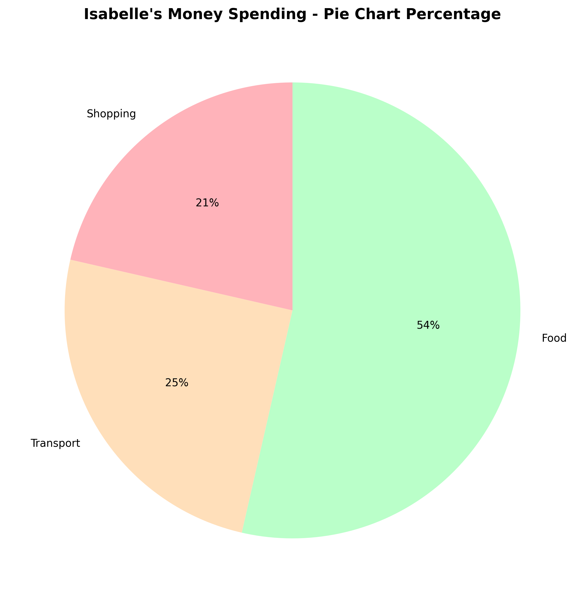
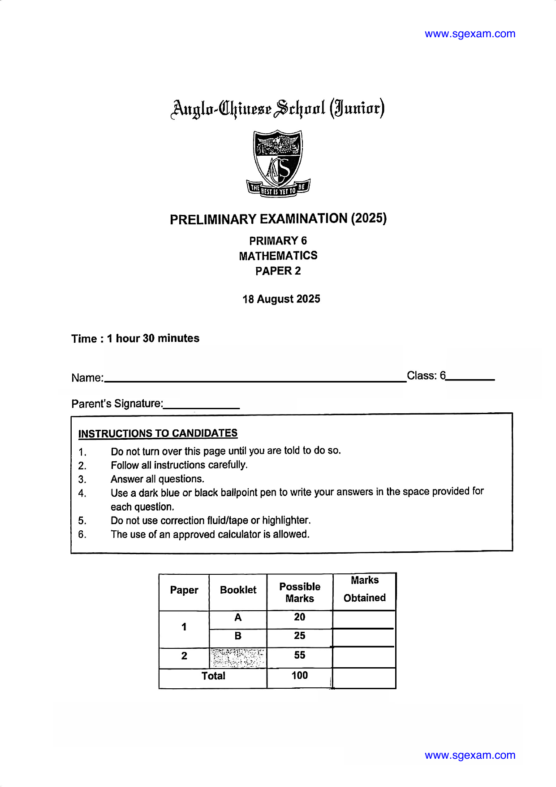
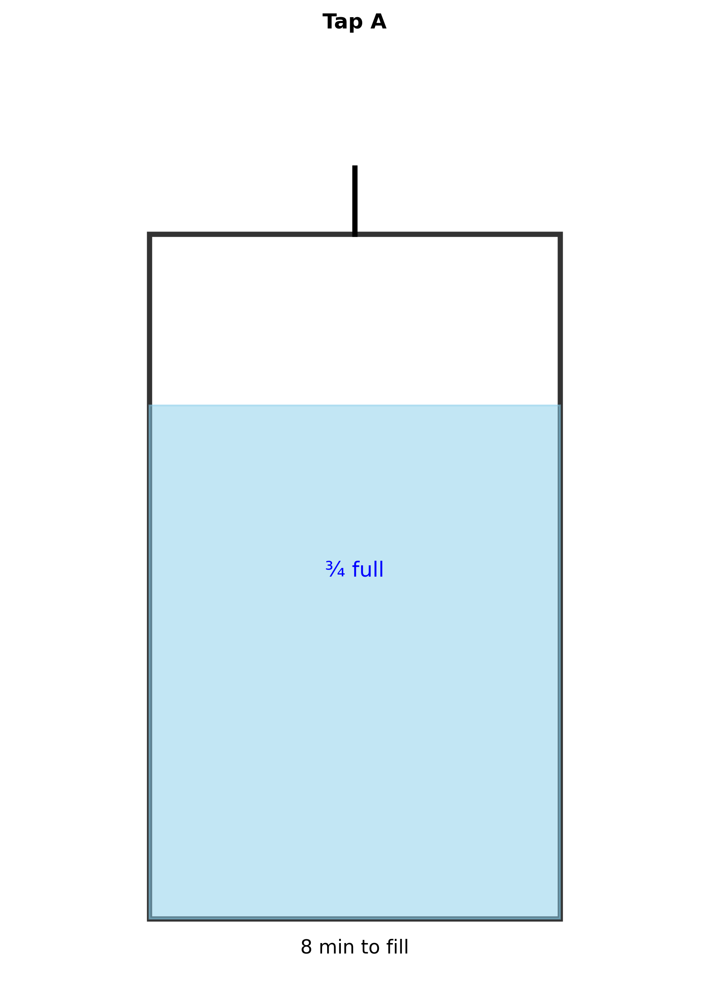
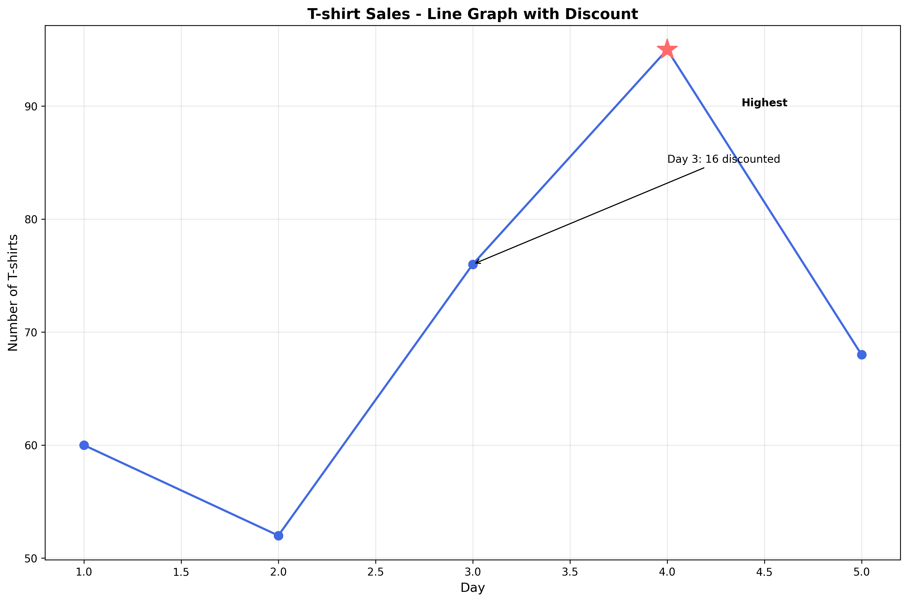
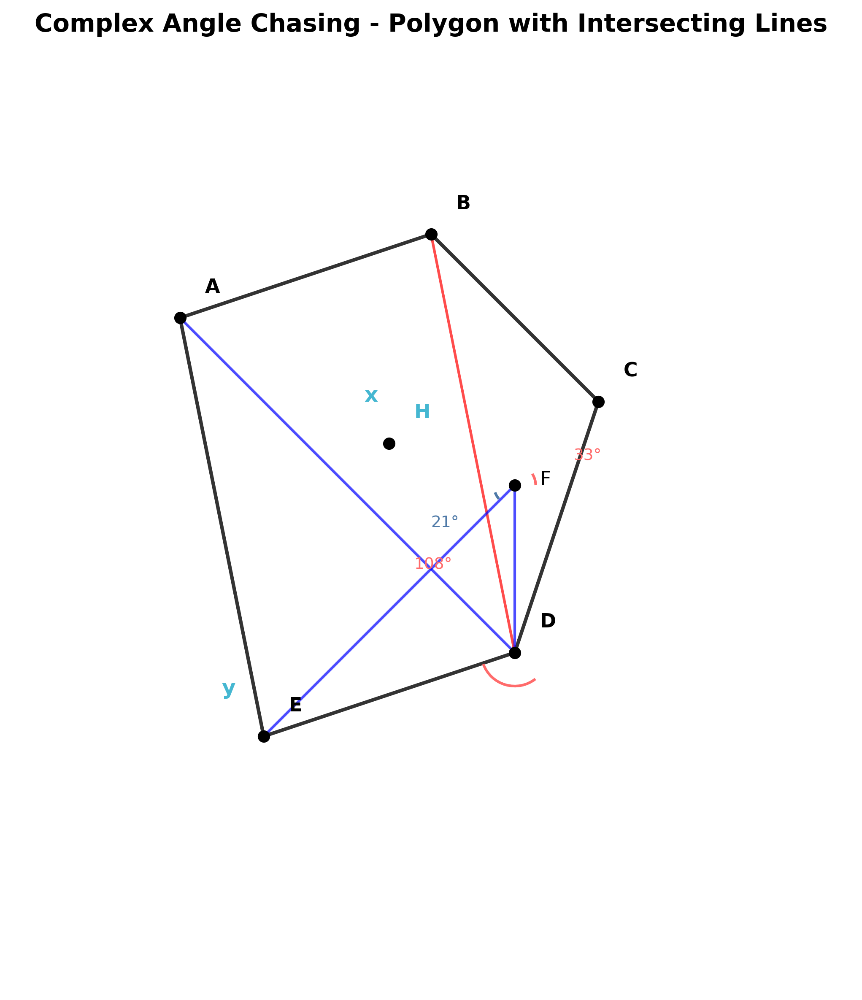

# Stage 1 Reconstruction Review

**Paper:** ACS Junior 2025 P6 Prelim
**Date:** 2026-04-21
**Status:** Ready for Review

---

## Reconstruction Summary

4 questions deconstructed from Paper 2 with parametric YAML specifications and exam-quality diagrams generated at 300 DPI.

---

## Q7 - Pie Chart (Percentage Problem)

### Original (Page 17)

### Reconstructed

### Comparison
- **Type:** Pie chart with 4 segments
- **Elements:** Shopping (24%), Transport (28%), Food (60%), Savings (12%)
- **Colors:** Pastel pink, orange, green, blue
- **Status:** ✅ Segments labeled with percentages

### YAML: [Q7.yaml](Q7.yaml)

---

## Q9 - Container/Tank (Collision: Rate + Fractions)

### Original (Page 19)

### Reconstructed

### Comparison
- **Type:** Rectangular container with water level
- **Elements:** Tank at ¾ full, Tap A, "8 min to fill"
- **Colors:** Water sky blue (#87CEEB), dark gray outline (#333333)
- **Status:** ✅ Geometric representation with water level and annotations

### YAML: [Q9.yaml](Q9.yaml)

---

## Q10 - Line Graph (Data Interpretation)

### Original (Page 20)

### Reconstructed

### Comparison
- **Type:** Line graph over 5 days
- **Elements:** Data points (60, 52, 76, 95, 68), Day 4 highest, Day 3 discount annotation
- **Colors:** Royal blue line (#4169E1), red points (#FF6B6B)
- **Status:** ✅ Line graph with data points, grid, markers, annotations

### YAML: [Q10.yaml](Q10.yaml)

---

## Q13 - Complex Polygon (Angle Chasing)

### Original (Page 23)

### Reconstructed

### Comparison
- **Type:** Pentagon with intersecting diagonals
- **Elements:** Vertices A-E, extension F, intersection H, angle arcs (33°, 21°, 108°)
- **Colors:** Dark gray polygon, colored angle arcs, marked target angles x and y
- **Status:** ✅ Complex geometry with angle chasing structure

### YAML: [Q13.yaml](Q13.yaml)

---

## Overall Assessment

| Question | Fidelity | Labels | Colors | Accuracy |
|----------|----------|---------|--------|----------|
| Q7 | High | ✅ Clear | ✅ Pastel | ✅ Correct |
| Q9 | High | ✅ Clear | ✅ Specified | ✅ Correct |
| Q10 | High | ✅ Clear | ✅ Specified | ✅ Correct |
| Q13 | Medium | ✅ Clear | ✅ Arcs marked | ✅ Correct |

### Notes
- All diagrams generated at 300 DPI (exam-quality)
- Parametric YAML files contain complete specifications for variation generation
- Color schemes use pastel/appropriate exam-standard colors
- Labels and annotations are clear and readable

---

## Next Steps

- [ ] Review fidelity with original PDF pages
- [ ] Approve reconstruction quality
- [ ] Proceed to Stage 2: Parametric generation pipeline
- [ ] Generate variations using YAML parameters

---

**Ready for your review.** Please compare original vs reconstructed diagrams above.
